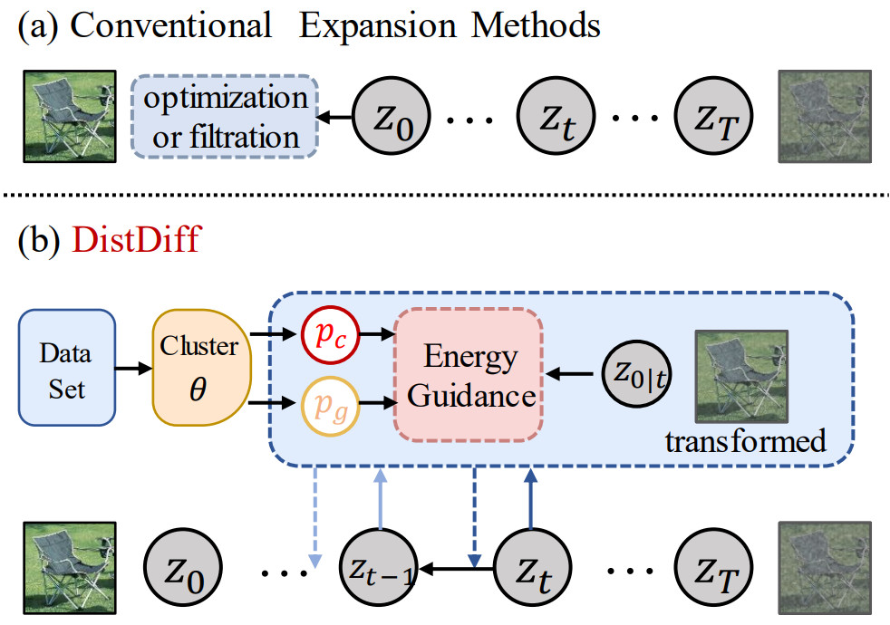

# Distribution-Aware Data Expansion with Diffusion Models
This is the official repository of [Distribution-Aware Data Expansion with Diffusion Models]().

## Highlights



> **<p align="justify"> Abstract:** *The scale and quality of a dataset signiffcantly impact the performance of deep models. However, acquiring large-scale annotated datasets is both a costly and time-consuming endeavor. To address this challenge, dataset expansion technologies  aim to automatically augment datasets, unlocking the full potential of deep models. Current  data expansion methods encompass image transformation-based and synthesis-based methods.  The transformation-based methods introduce only local variations, resulting in poor diversity. While image synthesis-based methods can create entirely new content, signiffcantly enhancing informativeness.  However, existing synthesis methods  carry the risk of distribution deviations, potentially  degrading model performance with outof-distribution  samples. In this paper, we propose DistDiff, an effective data expansion framework based on the distribution-aware diffusion model. DistDiff constructs hierarchical prototypes to approximate  the real data distribution, optimizing latent data points within diffusion models with hierarchical energy guidance. We demonstrate its ability to generate distribution-consistent samples,  achieving substantial improvements in data expansion tasks. Speciffcally, without additional training, DistDiff achieves a 30.7% improvement in accuracy across six image datasets compared to the model trained on original datasets and a 9.8% improvement compared to the state-of-the-art diffusion-based method.* </p>


## Main Contributions
1)  We introduce a novel diffusion-based data expansion algorithm,
 named **DistDiff**, which facilitates distribution consistent
 data augmentation without requiring retraining.
2)   By leveraging hierarchical prototypes to approximate
data distribution, we propose an effective distribution-aware
 energy guidance at both class and group levels
in the diffusion sampling process.
3) The experimental results illustrate that our DistDiff is
capable of generating high-quality samples, surpassing
existing image transformation and synthesis methods
significantly.


## 2. Method Pipeline
Please refer to the [paper](https://) for more technical details.


<p align="center">

</p>


## 3. RUN Experiments
Please refer [INSTALL](INSTALL.md) to install necessary libraries and data.
Then use following command to run DistDiff:
```
cd src/
sh single_exp.sh
```
* Please note that if your system doesn't possess 4 GPUs, 
you can modify the `total_split` parameter in `scripts/exps/expand_diff.sh` to 
reflect the actual number of GPUs you have, 
and make corresponding adjustments to the `split` value .


## 4. Citation

If you find our work inspiring in your research, please cite our work.

```
@article
```
