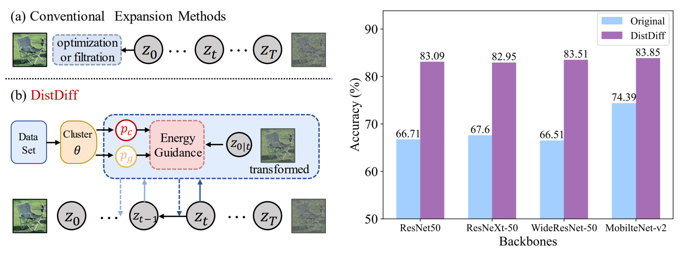
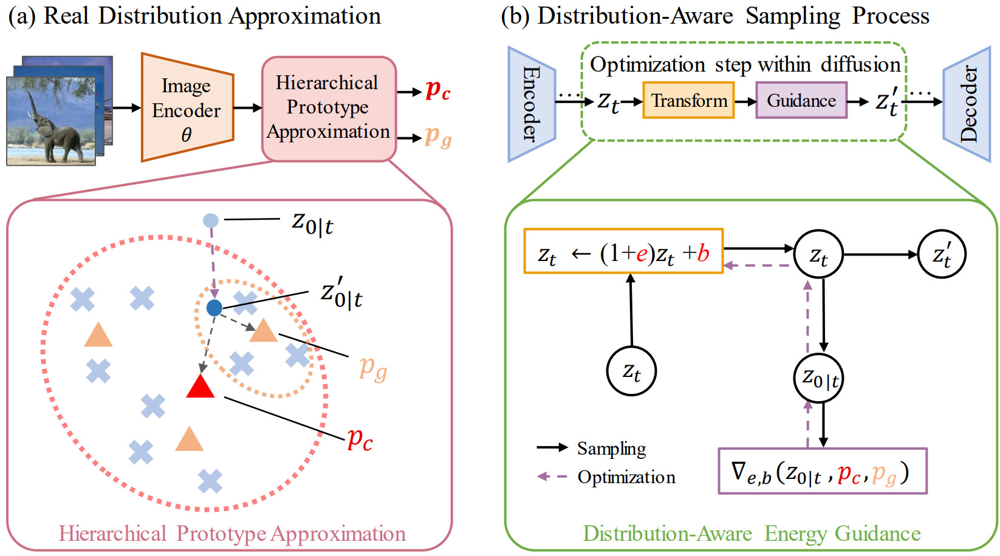

# Distribution-Aware Data Expansion with Diffusion Models
This is the official repository of  [Distribution-Aware Data Expansion with Diffusion Models (DistDiff)](https://arxiv.org/abs/2403.06741).

<hr />

## 1. Highlights




> **<p align="justify"> Abstract:** *The scale and quality of a dataset significantly impact the performance of deep models. However, acquiring large-scale annotated datasets is both a costly and time-consuming endeavor. To address this challenge, dataset expansion technologies aim to automatically augment datasets, unlocking the full potential of deep models. Current data expansion methods encompass image transformation-based and synthesis-based methods. The transformation-based methods introduce only local variations, resulting in poor diversity. While image synthesis-based methods can create entirely new content, significantly enhancing informativeness. However, existing synthesis methods carry the risk of distribution deviations, potentially degrading model performance with out-of-distribution samples. In this paper, we propose DistDiff, an effective data expansion framework based on the distribution-aware diffusion model. DistDiff constructs hierarchical prototypes to approximate the real data distribution, optimizing latent data points within diffusion models with hierarchical energy guidance. We demonstrate its ability to generate distribution-consistent samples, achieving substantial improvements in data expansion tasks. Specifically, without additional training, DistDiff achieves a 30.7% improvement in accuracy across six image datasets compared to the model trained on original datasets and a 9.8% improvement compared to the state-of-the-art diffusion-based method.* </p>

<hr />

## 2. Main Contributions
1)  We introduce a novel diffusion-based data expansion algorithm, named **DistDiff**, which facilitates distribution consistent data augmentation without requiring retraining.
2)  By leveraging hierarchical prototypes to approximate data distribution, we propose an effective distribution-aware energy guidance at both class and group levels in the diffusion sampling process.
3) The experimental results illustrate that our DistDiff is capable of generating high-quality samples, surpassing existing image transformation and synthesis methods significantly.

<hr />

## 3. Method Pipeline

<p align="center">
  
</p>

Please refer to the [paper](https://arxiv.org/abs/2403.06741) for more technical details.

<hr />

## 4. How to Run Experiments?
### 4.1  Setup & Preparation
Please follow the instructions detailed in [INSTALL.md](INSTALL.md) to install necessary libraries and prepare all datasets.

<hr />

### 4.2 Run Experiments
**1) Data Expansion**
* We utilize 4 distinct GPUs to execute the entire program. This is achieved by modifying CUDA_VISIBLE_DEVICES=N and setting --split N for each GPU, where N ranges from 0 to 3.
```
cd src/
sh scripts/exps/expand_diff.sh ${DATASET} ${START} ${END} 0.8 ${K} 0 0 &
sh scripts/exps/expand_diff.sh ${DATASET} ${START} ${END} 0.8 ${K} 1 1 &
sh scripts/exps/expand_diff.sh ${DATASET} ${START} ${END} 0.8 ${K} 2 2 &
sh scripts/exps/expand_diff.sh ${DATASET} ${START} ${END} 0.8 ${K} 3 3 
```
* Please note that if your system doesn't possess 4 GPUs, you can modify the `total_split` parameter in `scripts/exps/expand_diff.sh` to reflect the actual number of GPUs you have, and make corresponding adjustments to the `SPLIT` and `GPU`.

**2) Training and Evaluation**
* After data expansion, use the following script to train and evaluate the backbone on the expanded datasets.

```
sh scripts/exps/train_expand.sh ${DATASET} ${BACKBONE} 0.1 ${EXP} False ${GPU}
```

* You can also execute previous steps jointly by:
```
sh single_exp.sh
```

<hr />

## Citation

If you find our work inspiring in your research, please cite our work.

```
@misc{zhu2024distributionaware,
      title={Distribution-Aware Data Expansion with Diffusion Models}, 
      author={Haowei Zhu and Ling Yang and Jun-Hai Yong and Wentao Zhang and Bin Wang},
      year={2024},
      eprint={2403.06741},
      archivePrefix={arXiv},
      primaryClass={cs.CV}
}
```

<hr />

## Acknowledgments

Our code is based on [GIF-SD](https://github.com/Vanint/DatasetExpansion) repository. We thank the authors for releasing their code. If you use our model and code, please consider citing these works as well.


